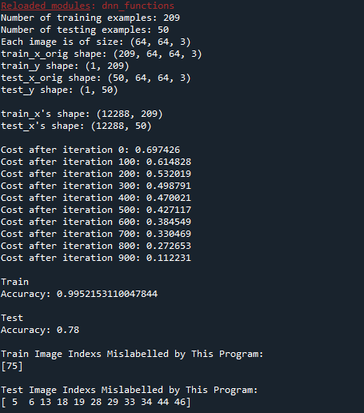

# Deep-Neural-Net

This repo contains the core deep neural network functions like forward propagation, back propagation, cost, model, train, test function written in Python from scratch. 

dd_functions.py is helper script and contains the functions and Example_DNN.py is an example application script of these functions.

## Dependencies
* Python >= 3.9.13
    * Pip: [click here for installation instructions](https://pip.pypa.io/en/stable/installation/)

## Instructions

1. Clone the project repository.

2. Change the value of "num_iterations" argument in "Example_DNN.py" line 66. [Optional]

3. Install the requirements: `pip install -r requirements.txt` 

4. Run the project: `python Example_DNN.py`

5. The output should look like the following:

